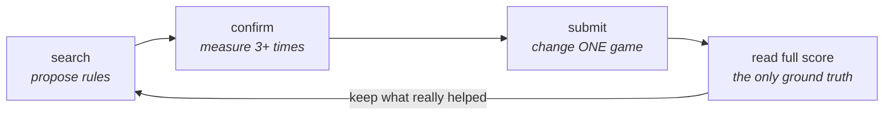
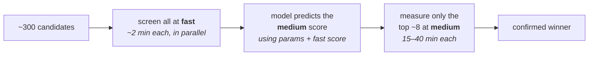

# tabletop-game-balancer

Entry for the [2026 Tabletop Games Balancing Competition](https://balance-competition.tabletopgames.ai)
(IEEE CoG 2026). **Best score: 3652.5 / 4000**, from about 9,000 evaluations.
The submitted rules are in [`results/winning_submission.json`](results/winning_submission.json).

## The problem

Four games: Dominion, Exploding Kittens, 7 Wonders, Can't Stop. You pick the
rules. A server plays each game many times with four fixed AI players and scores
how balanced it came out, up to 1000 per game.

You cannot see inside. You send rules, you get back one number.

You also choose how many games the server plays first:

| setting | games played | time per run |
|---|---|---|
| `fast` | 36 | 2–15 min |
| `medium` | 360 | 15–40 min |
| `full` | 3,600 | hours — the leaderboard uses this |

The optimisers here are ordinary. What decided the score was **how we measured**.



---

## Methods

### 1. Measure again before believing

A `fast` run is only 36 games, so one score is mostly luck.

We learned this the hard way. Taking each game's best single score gave a bundle
that read **3781**. Measured properly, it was **3485**. Nearly 300 points were
noise.

So [`evaluate.py`](src/ttbalance/evaluate.py) stores every measurement ever made
and never repeats work. `Evaluator.race()` runs a knockout: measure everything
once, drop the losers, measure the survivors more. Nothing gets submitted until
it has been measured at least three times.

### 2. Check the cheap test per game

The obvious way to save time is to search with `fast` and only confirm winners
at `medium`. Whether that works **depends on the game**, so we measured it
instead of assuming.

For Dominion the cheap test agrees with the expensive one (fast 963 → medium
971, 961 → 969). For Exploding Kittens it mostly does not, and a `fast`-driven
search made that game *worse* for hours before we checked.

The test: is the gap between configurations bigger than the measurement noise?

| game | gap between configs | noise | ratio | can `medium` rank them? |
|---|---|---|---|---|
| Exploding Kittens | 104.5 | 21.2 | **8.5** | yes |
| 7 Wonders | 47.2 | 22.1 | 3.7 | barely |
| Can't Stop | 25.3 | 13.1 | 3.3 | barely |
| Dominion | 18.0 | 12.7 | 2.5 | no |

Only Exploding Kittens can be ranked reliably. We spent our search time there.
Run it yourself: `./scripts/reproduce.sh diagnose`.

### 3. Change one game per submission

Submissions are unlimited, and the leaderboard is the **only** place we can see
a `full` score. So every submission is an experiment — and an experiment only
tells you something if you change one thing.

One bundle changed three games at once. It gained **+45** by our own
measurements and **+1.6** on the leaderboard. We split it into three submissions
that each changed one game. The entire loss came from a single game (7 Wonders),
and fixing just that recovered **+35**.

[`transfer.py`](src/ttbalance/transfer.py) works out per-game transfer rates
from the submission history. Single-game changes off a well-measured baseline
carry over almost fully. Bundles built on thin measurements carry over at 0.13.

### 4. Surrogate search

[`optimizers/`](src/ttbalance/optimizers/) has `random` and `hill` as controls,
`pbil` (averages over a whole generation, so noise hurts it less), and `nori` —
a loop around [Synthefy's Nori](https://github.com/Synthefy/synthefy-nori)
tabular foundation model.

Each round:

1. Show Nori every configuration measured so far, with its `medium` score. Only
   `medium` — `fast` scores would teach it the wrong thing.
2. Invent ~2,000 new configurations and have Nori predict all of them at once.
3. Rank them by `q50 + κ·(q90 − q50)`: prefer a high predicted score, plus a
   bonus where the model is unsure.
4. Actually measure the top ~10. Add the results. Repeat.

It also shrinks its search radius when progress stalls and expands it when
things are working (TuRBO-style), avoids picking near-identical candidates in
one batch, and re-measures its current leaders as it goes.

Three of the four configurations in the final bundle were **never measured at
`fast` at all** — proposed straight at `medium` by this loop. Why this kind of
model, and what it cannot do, has
[its own section below](#why-a-tabular-foundation-model--and-where-it-falls-short).

### 5. Use the cheap score as a *clue*, not a *ranking*

Ranking by `fast` fails. But that only rules out `fast` as a **ranking**. As one
input among many it is still useful — a model can learn a weak or even backwards
relationship and still profit from it.



[`multifidelity.py`](src/ttbalance/multifidelity.py) trains on
`[parameters, fast score] → medium score`, leaving the cheap column blank where
that configuration was never run cheaply. Tested by leave-one-out on the 18
Exploding Kittens configurations that have both: average error drops from
**28.21 to 25.97** (predicting the average would give 35.10).
[`scripts/mf_screen.py`](scripts/mf_screen.py) runs this loop.

### 6. Read what the score is made of

The server logs more than the final number. [`modal_localapi.py`](modal_localapi.py)
reads its output and pulls out `matrix_distance`, `fpa_diff`, and both the
actual and target win-rate tables.

For our best Exploding Kittens rules, **all** the lost points come from the
win-rate table (distance 190); first-player fairness is already perfect
(`fpa_diff` 0). The single biggest miss: the strongest AI should beat the
second-strongest **60%** of the time, and only manages **33.3%**. Our search had
been flattening the skill gap when the target wanted it steeper.

This season's target tables are not published anywhere, so reading them out of
the log is the only way to see them.

### 7. Run many evaluations at once

We measured this rather than assuming it: the evaluator image runs **one game
process at a time** and does not queue. One container gives you no parallelism
no matter how many cores it has — a 6-CPU container finished the same job in
2352 s versus 2379 s for 1 CPU.

So throughput means many containers, each handling exactly one request at a
time. [`scripts/localapi.sh`](scripts/localapi.sh) runs a local pool.
[`modal_localapi.py`](modal_localapi.py) runs the same image on Modal as a
*function*, not a web endpoint — a web request times out around 150 s and our
evaluations take up to 40 minutes.

---

## Why a tabular foundation model — and where it falls short

Nori learns from examples given to it in the moment: hand it a table of
configurations and their scores, and it predicts new rows in one pass. There is
no training step and nothing to tune.

That matters because of how this search actually runs. Every round adds ~10 new
measurements and the model is rebuilt from scratch — about 40 times per game.
Anything with settings of its own becomes a second tuning problem sitting on top
of the one being solved.

### What this problem demands

Six things, and they knock out most of the usual choices:

| What the search needs | Tabular foundation model | Gaussian process | Gradient boosting | Linear model |
|---|---|---|---|---|
| **Rebuild ~40× per game** as results arrive | free — hand it the table | needs a kernel choice and a fresh fit each time | fast, but has its own settings | free |
| **13–36 mixed columns** — ordered numbers next to yes/no flags for which cards are in play | handles both | needs a custom kernel per game | handles both | needs interaction terms written by hand |
| **Blank cells** where a configuration was never run cheaply (see §5) | handles them | no — must invent a fill-in value | handles them | no |
| **A range, not one number**, so the search knows where it is unsure | gives q10 / q50 / q90 | yes — this is its whole purpose | only with extra work | only under assumptions |
| **20–750 labelled rows** per game | built for this size | built for this size | overfits | fits, but too rigid to capture the shape |
| **Labels of unequal reliability** — a score from 1 repeat vs 7 | **no** | yes — a per-point noise term | no | only with weights |

The last row is the one place a Gaussian process is plainly better, and it is
not a small point on an objective this noisy.

The range in row four is what drives the search. Candidates are ranked by
`q50 + κ·(q90 − q50)` — the predicted score, plus a bonus wherever the model
admits it does not know. Without that second term the search only ever revisits
what already looks good.

### Where it falls short

| Limitation | What it cost | What we did about it |
|---|---|---|
| **Every label weighs the same.** A score averaged over 7 measurements counts no more than one lucky single run. | The model happily chases noise. Early on this is exactly how a bundle reads 3781 and confirms at 3485. | Confirmation happens *outside* the model. Nothing is believed until it survives 3+ repeats (§1). |
| **Bad input, confident bad output.** | Fed `fast` scores for Exploding Kittens, it reproduced the misleading pattern faithfully — and with a *narrow* confidence range, so the search never doubted it. | `fast` is never used as a label. It enters only as one more column (§5). A model cannot repair a measurement mistake. |
| **Nothing to look inside.** No kernel, no coefficients, no importances. | "Which parameter actually matters?" is unanswerable from the model. | Answered separately: one-variable-at-a-time submissions (§3) and the score breakdown (§6). |
| **Wrong tool below ~15 rows.** | The `medium → full` relationship gets one new label per submission — 14 in total. | Plain regression there instead: [`calibrate.py`](src/ttbalance/calibrate.py), [`transfer.py`](src/ttbalance/transfer.py). |
| **Each round is a network call.** | Irrelevant here, since one `medium` measurement takes 15–40 minutes anyway. | Would rule it out entirely for a cheap objective. |
| **Never proved better than the alternatives.** | No head-to-head against `pbil` on identical data was ever run. | The honest claim: these configurations came out of this loop — not that nothing else would have found them. |

The pattern across the table is that the model is good at *proposing* and bad at
*judging*. Everything that decides what to believe — repeat counts, which
measurement to trust, what a change was really worth — is handled by the
measurement discipline around it, not by the model.


## Running it

```bash
./scripts/reproduce.sh check       # offline: tests + an optimiser run, no API needed
./scripts/reproduce.sh evaluator   # start 10 local evaluator containers (needs Docker)
./scripts/reproduce.sh diagnose    # per-game noise check from §2
./scripts/reproduce.sh search      # search at medium, one loop per game
./scripts/reproduce.sh confirm     # knockout the leaders to 3+ measurements
./scripts/reproduce.sh bundle      # print the submission JSON
```

`check` needs only Python and takes about a minute. It runs the tests and a full
optimiser loop against [`mock.py`](src/ttbalance/mock.py), a stand-in for the
API that runs offline. The later steps need a real evaluator and take hours.

For Modal: `modal deploy modal_localapi.py`, then pass `--backend modal`.

---

## Layout

```
src/ttbalance/
  spec.py           the rules you can change, and how to mutate them
  client.py         evaluator backends: local, local pool, hosted, Modal
  cache.py          every measurement ever made (SQLite)
  evaluate.py       parallel measurement, budgets, and the knockout
  encode.py         a configuration -> a row of numbers
  multifidelity.py  cheap score as an input for predicting the expensive one
  transfer.py       how much a medium gain carries over to full, per game
  calibrate.py      medium estimate -> expected full score
  mock.py           offline stand-in, so everything runs without the API
  optimizers/       random, hill, pbil, ea, nori
scripts/            evaluator pool, search loops, confirmation, screening
docs/COMPETITION.md the task, the API, the scoring
```

44 tests: `PYTHONPATH=src python3 -m unittest discover -s tests -t .`

---

## Lessons

Every submission's real score is in [`docs/SUBMISSIONS.md`](docs/SUBMISSIONS.md).

### What worked

* **Never trust one measurement.** Everything gets 3+ repeats before it is
  believed. The first bundle, built from each game's best single score, read
  **3781** and was really **3485** — nearly 300 points of luck.
* **One change per submission.** This turns every submission into a clean
  experiment. A single-game change carried over at **2.83×** its measured size;
  a three-game bundle carried over at **0.04×**.
* **Open the black box.** The server logs the actual and target win-rate tables.
  The season's targets are published nowhere else.
* **Cheap score as an input, not a ranking.** Average error predicting `medium`
  drops from **28.21 to 25.97** when the `fast` score is one more column.

### What went wrong

One mistake repeats throughout: **reading a pattern out of very few points, then
betting on it.**

* *"`fast` is backwards for Exploding Kittens, correlation −0.79."* Measured
  properly on the 18 configurations that have both, it is **+0.43**. Weak, not
  backwards. The −0.79 was a rank correlation on a much smaller early sample,
  and it got quoted as settled fact for days.
* *"For 7 Wonders, a higher `medium` score means a worse `full` score."* Built
  from one pair of submissions. Both probes testing it came back **positive**
  (+5.9 and +4.2). There was no such relationship.
* *"Dominion's `fast` is trustworthy"* — from **two** matching data points
  (963 → 971, 961 → 969). A submission built on that swapped in a
  higher-`fast` Dominion configuration and **lost 32.4 points**. The most
  expensive of these mistakes.

The pattern is always the same: a small sample produces a clean-looking story,
the story becomes the plan, and the plan costs more than the noise it was
built on. The habit that fixed it everywhere else — *measure again before
believing* — is exactly the one that kept getting skipped when the claim was
about a **relationship** rather than a score.

Two more, less dramatic:

* **Trusting the §6 breakdown when read at `fast`.** Twice it produced a
  convincing direction (`SEETHEFUTURE=6`, then `NOPE=10`, each roughly halving
  the distance) that `medium` then rejected. The breakdown is sound; reading it
  at the cheap setting was not — the same trap as §2.
* **A variance idea** — that well-balanced rules should bounce around more
  between repeats, since their measured distance is mostly noise. Checked
  against two configurations whose real scores we knew, and it was wrong: 15.3
  versus 16.3, the opposite way round. Cheap to test, so cheap to drop.

## Thanks

To the [TAG framework](https://github.com/GAIGResearch/TabletopGames) and the
competition organisers for shipping a local evaluator image. The whole approach
depends on being able to run evaluations off the hosted queue.
