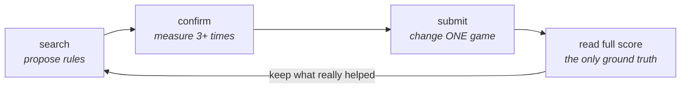
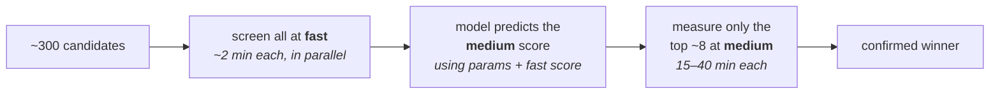

# tabletop-game-balancer

Entry for the [2026 Tabletop Games Balancing Competition](https://balance-competition.tabletopgames.ai)
(IEEE CoG 2026). **Best score: 3652.5 / 4000**, from about 9,000 evaluations.
The submitted rules are in [`results/winning_submission.json`](results/winning_submission.json).

## The problem

Four games: Dominion, Exploding Kittens, 7 Wonders, Can't Stop. You pick the
rules. A server plays each game many times with four fixed AI players and scores
how balanced it came out, up to 1000 per game.

You cannot see inside. You send rules, you get back one number.

You also choose how many games the server plays first:

| setting | games played | time per run |
|---|---|---|
| `fast` | 36 | 2–15 min |
| `medium` | 360 | 15–40 min |
| `full` | 3,600 | hours — the leaderboard uses this |

The optimisers here are ordinary. What decided the score was **how we measured**.



---

## Methods

### 1. Measure again before believing

A `fast` run is only 36 games, so one score is mostly luck.

We learned this the hard way. Taking each game's best single score gave a bundle
that read **3781**. Measured properly, it was **3485**. Nearly 300 points were
noise.

So [`evaluate.py`](src/ttbalance/evaluate.py) stores every measurement ever made
and never repeats work. `Evaluator.race()` runs a knockout: measure everything
once, drop the losers, measure the survivors more. Nothing gets submitted until
it has been measured at least three times.

### 2. Check the cheap test per game

The obvious way to save time is to search with `fast` and only confirm winners
at `medium`. Whether that works **depends on the game**, so we measured it
instead of assuming.

For Dominion the cheap test agrees with the expensive one (fast 963 → medium
971, 961 → 969). For Exploding Kittens it mostly does not, and a `fast`-driven
search made that game *worse* for hours before we checked.

The test: is the gap between configurations bigger than the measurement noise?

| game | gap between configs | noise | ratio | can `medium` rank them? |
|---|---|---|---|---|
| Exploding Kittens | 104.5 | 21.2 | **8.5** | yes |
| 7 Wonders | 47.2 | 22.1 | 3.7 | barely |
| Can't Stop | 25.3 | 13.1 | 3.3 | barely |
| Dominion | 18.0 | 12.7 | 2.5 | no |

Only Exploding Kittens can be ranked reliably. We spent our search time there.
Run it yourself: `./scripts/reproduce.sh diagnose`.

### 3. Change one game per submission

Submissions are unlimited, and the leaderboard is the **only** place we can see
a `full` score. So every submission is an experiment — and an experiment only
tells you something if you change one thing.

One bundle changed three games at once. It gained **+45** by our own
measurements and **+1.6** on the leaderboard. We split it into three submissions
that each changed one game. The entire loss came from a single game (7 Wonders),
and fixing just that recovered **+35**.

[`transfer.py`](src/ttbalance/transfer.py) works out per-game transfer rates
from the submission history. Single-game changes off a well-measured baseline
carry over almost fully. Bundles built on thin measurements carry over at 0.13.

### 4. Surrogate search

[`optimizers/`](src/ttbalance/optimizers/) has `random` and `hill` as controls,
`pbil` (averages over a whole generation, so noise hurts it less), and `nori` —
a loop around [Synthefy's Nori](https://github.com/Synthefy/synthefy-nori)
tabular foundation model.

Each round:

1. Show Nori every configuration measured so far, with its `medium` score. Only
   `medium` — `fast` scores would teach it the wrong thing.
2. Invent ~2,000 new configurations and have Nori predict all of them at once.
3. Rank them by `q50 + κ·(q90 − q50)`: prefer a high predicted score, plus a
   bonus where the model is unsure.
4. Actually measure the top ~10. Add the results. Repeat.

It also shrinks its search radius when progress stalls and expands it when
things are working (TuRBO-style), avoids picking near-identical candidates in
one batch, and re-measures its current leaders as it goes.

Three of the four configurations in the final bundle were **never measured at
`fast` at all**. Nori proposed them directly at `medium`.

<details>
<summary><b>Why a tabular foundation model — and where it falls short</b></summary>

Nori learns from examples in context: give it labelled rows, it predicts new
ones in one pass. No training step, no hyperparameters to tune. Four reasons
that fit this problem:

* **Refitting is free.** We rebuild the model every round on more data. A
  Gaussian process needs a kernel choice and a fresh hyperparameter fit each
  time. Nori just takes the table.
* **It reads mixed columns.** Our configurations become 13–36 columns: ordered
  numbers next to yes/no flags for which cards and wonders are in play. A GP
  would need a custom kernel for that.
* **Missing values are fine.** This is what makes §5 work: a configuration never
  run at `fast` gets a blank in that column, not a made-up number.
* **It gives a range, not just a guess.** `q90 − q50` is the "how unsure am I"
  term in step 3. A model that only outputs one number cannot tell you where
  exploring is worth it.

The data size suits it too — 20 to 750 labelled rows per game is far too few to
train a network from scratch.

The drawbacks are real:

* **It treats all labels as equally trustworthy.** A score averaged over one
  measurement counts the same as one averaged over seven. Our objective is very
  noisy and the counts vary, which is exactly what classical Bayesian
  optimisation models explicitly and this does not.
* **Bad input, confident bad output.** Fed `fast` scores for Exploding Kittens,
  it learned the misleading pattern faithfully and pointed the search at bad
  configurations with a *narrow* confidence range. A GP with a noise term would
  at least have widened. The model cannot fix a measurement mistake — see §2.
* **You cannot look inside.** No kernel to inspect, no coefficients to read.
  "Which parameter actually matters?" had to be answered by separate analysis.
* **Wrong tool below ~15 labels.** The `medium → full` calibration gets one
  label per submission, so [`calibrate.py`](src/ttbalance/calibrate.py) and
  [`transfer.py`](src/ttbalance/transfer.py) use plain regression there instead.
* **We never proved it beat the alternatives.** No head-to-head against `pbil`
  on the same `medium` data was run. The honest claim is that these
  configurations came out of the Nori loop, not that nothing else would have
  found them.

</details>

### 5. Use the cheap score as a *clue*, not a *ranking*

Ranking by `fast` fails. But that only rules out `fast` as a **ranking**. As one
input among many it is still useful — a model can learn a weak or even backwards
relationship and still profit from it.



[`multifidelity.py`](src/ttbalance/multifidelity.py) trains on
`[parameters, fast score] → medium score`, leaving the cheap column blank where
that configuration was never run cheaply. Tested by leave-one-out on the 18
Exploding Kittens configurations that have both: average error drops from
**28.21 to 25.97** (predicting the average would give 35.10).
[`scripts/mf_screen.py`](scripts/mf_screen.py) runs this loop.

### 6. Read what the score is made of

The server logs more than the final number. [`modal_localapi.py`](modal_localapi.py)
reads its output and pulls out `matrix_distance`, `fpa_diff`, and both the
actual and target win-rate tables.

For our best Exploding Kittens rules, **all** the lost points come from the
win-rate table (distance 190); first-player fairness is already perfect
(`fpa_diff` 0). The single biggest miss: the strongest AI should beat the
second-strongest **60%** of the time, and only manages **33.3%**. Our search had
been flattening the skill gap when the target wanted it steeper.

This season's target tables are not published anywhere, so reading them out of
the log is the only way to see them.

### 7. Run many evaluations at once

We measured this rather than assuming it: the evaluator image runs **one game
process at a time** and does not queue. One container gives you no parallelism
no matter how many cores it has — a 6-CPU container finished the same job in
2352 s versus 2379 s for 1 CPU.

So throughput means many containers, each handling exactly one request at a
time. [`scripts/localapi.sh`](scripts/localapi.sh) runs a local pool.
[`modal_localapi.py`](modal_localapi.py) runs the same image on Modal as a
*function*, not a web endpoint — a web request times out around 150 s and our
evaluations take up to 40 minutes.

---

## Running it

```bash
./scripts/reproduce.sh check       # offline: tests + an optimiser run, no API needed
./scripts/reproduce.sh evaluator   # start 10 local evaluator containers (needs Docker)
./scripts/reproduce.sh diagnose    # per-game noise check from §2
./scripts/reproduce.sh search      # search at medium, one loop per game
./scripts/reproduce.sh confirm     # knockout the leaders to 3+ measurements
./scripts/reproduce.sh bundle      # print the submission JSON
```

`check` needs only Python and takes about a minute. It runs the tests and a full
optimiser loop against [`mock.py`](src/ttbalance/mock.py), a stand-in for the
API that runs offline. The later steps need a real evaluator and take hours.

For Modal: `modal deploy modal_localapi.py`, then pass `--backend modal`.

---

## Layout

```
src/ttbalance/
  spec.py           the rules you can change, and how to mutate them
  client.py         evaluator backends: local, local pool, hosted, Modal
  cache.py          every measurement ever made (SQLite)
  evaluate.py       parallel measurement, budgets, and the knockout
  encode.py         a configuration -> a row of numbers
  multifidelity.py  cheap score as an input for predicting the expensive one
  transfer.py       how much a medium gain carries over to full, per game
  calibrate.py      medium estimate -> expected full score
  mock.py           offline stand-in, so everything runs without the API
  optimizers/       random, hill, pbil, ea, nori
scripts/            evaluator pool, search loops, confirmation, screening
docs/COMPETITION.md the task, the API, the scoring
```

44 tests: `PYTHONPATH=src python3 -m unittest discover -s tests -t .`

---

## What did not work

The failures carry most of the lesson.

* **Ranking by `fast`.** Sent the search backwards for hours on Exploding
  Kittens. The fix was checking each game, not a better optimiser.
* **Changing several games in one submission.** Only 13% of the gain carried
  over, because one part rested on a single measurement.
* **Trusting the §6 breakdown when read at `fast`.** Twice it produced a
  convincing direction (`SEETHEFUTURE=6`, then `NOPE=10`, each roughly halving
  the distance) that `medium` then rejected. The breakdown is sound; reading it
  at the cheap setting was not.
* **A variance idea** — that well-balanced rules should bounce around more
  between repeats, since their measured distance is mostly noise. Checked
  against two configurations whose real scores we knew. It was wrong: 15.3
  versus 16.3, the opposite way round.

## Thanks

To the [TAG framework](https://github.com/GAIGResearch/TabletopGames) and the
competition organisers for shipping a local evaluator image. The whole approach
depends on being able to run evaluations off the hosted queue.
